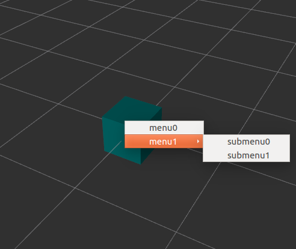
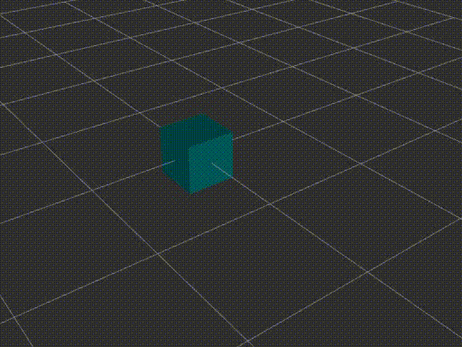

# ez_interactive_marker

[](https://travis-ci.org/neka-nat/ez_interactive_marker)

[](https://codeclimate.com/github/neka-nat/ez_interactive_marker)

Easily create interactive markers from yaml files.

## Quick start

You can create a box with a menu by creating the following setting file.

```yaml:simple_cube.yaml
sample:
  interactive_marker:
    name: 'simple_cube'
    header: {frame_id: 'base_link'}
    pose: {orientation: {w: 1.0}}
    controls:
      - always_visible: True
        interaction_mode: !enum [visualization_msgs/InteractiveMarkerControl, BUTTON]
        markers:
          - type: !enum [visualization_msgs/Marker, CUBE]
            scale: {x: 0.45, y: 0.45, z: 0.45}
            color: {r: 0.0, g: 0.5, b: 0.5, a: 1.0}
            pose: {orientation: {w: 1.0}}
  menu:
    - title: "menu0"
    - title: "menu1"
      children: [{title: "submenu0"}, {title: "submenu1"}]
```

Please execute the following command.

```
cd example
rosrun ez_interactive_marker ez_interactive_marker -c simple_cube.yaml
```

Or the following commands are publishing the configuration.

```
rosrun ez_interactive_marker ez_interactive_marker
# another console
cd example
rosrun ez_interactive_marker publish_config.py simple_cube.yaml
```



## Supported yaml tags

It is possible to use several tags in the configuration file.

### include
This tag includes the written configuration file and expand the contents.

```yaml
!include sub_settings.yaml
```

### enum
This tag expands the enum variable of the specified message module.

```yaml
!enum [visualization_msgs/Marker, CUBE]
```

### euler
This tag converts euler xyz angle to quaternion.

```yaml
!euler [3.14159, 0.0, 0.0] # -> {x: 1.0, y: 0.0, z: 0.0, w: 0.0}
```

### degrees
This tag converts degrees to radians.

```yaml
!degrees 90.0 # -> 1.5708
```

## Subscribers

Some subscribers are added when generating a interactive marker.

- **/ez_interactive_marker/\<interactive marker name\>/update_interactive_marker**
  - Keep the interactive marker's name and update it using `InteractiveMarker` message.

- **/ez_interactive_marker/\<interactive marker name\>/update_pose**
  - Update the interactive marker's pose.

- **/ez_interactive_marker/\<interactive marker name\>/add_control**
  - Add `InteractiveMarkerControl` to the interactive marker.

- **/ez_interactive_marker/\<interactive marker name\>/remove_control**
  - Delete matching `InteractiveMarkerControl` with `InteractiveMarkerControl.name`.

## Menu settings

You can specify several commands to be executed when menu is selected.

### publish topic

In the following example, the string "hello" is published to the topic of "test".
Please also see [this example](example/simple_cube.yaml).

```yaml
menu:
  - title: "menu0"
    command:
      type: 'topic_pub'
      args:
        name: '/test'
        type: 'std_msgs/String'
        data: {data: 'Hello.'}
```

### service call

In the following example, "add_two_ints" service is called.
Please also see [this example](example/add_two_ints.yaml).

```yaml
menu:
  - title: "menu0"
    command:
      type: 'service_call'
      args:
        name: 'add_two_ints'
        type: 'rospy_tutorials/AddTwoInts'
        data: {a: 1.0, b: 2.0}
```

### python function

In the following example, python function is called.
Please also see [this example](example/py_func.yaml).

```yaml
menu:
  - title: "loginfo"
    command:
      type: 'py_function'
      args:
        module: 'rospy'
        func: 'loginfo'
        args: {msg: 'Call rospy.loginfo!'}
```

### Grouped check box

You can create grouped checkboxes.

```yaml
menu:
  - title: "menu0"
    group: "a"
  - title: "menu1"
    group: "a"
  - title: "menu2"
    children:
      - title: "submenu0"
        group: "b"
      - title: "submenu1"
        group: "b"
      - title: "submenu2"
        group: "b"
```



In this case, menu0 and menu1 belong to group a,
and submenu0, submenu1 and submenu2 belong to group b.

Check boxes are controlled exclusively within the same group.